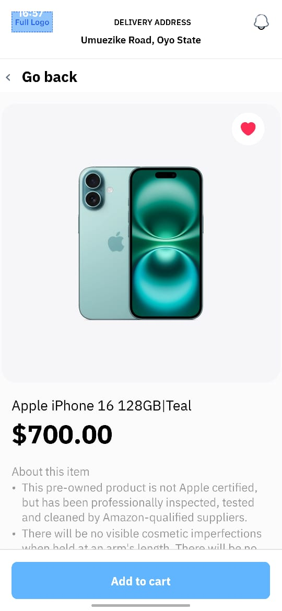
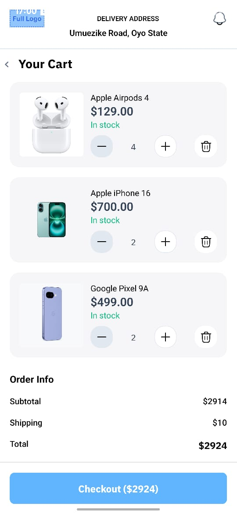
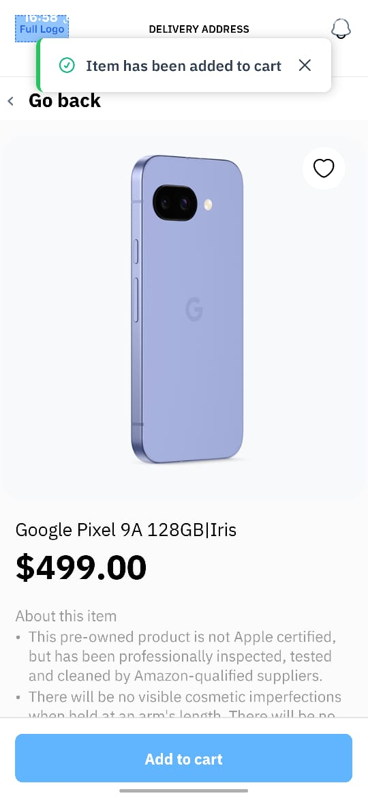
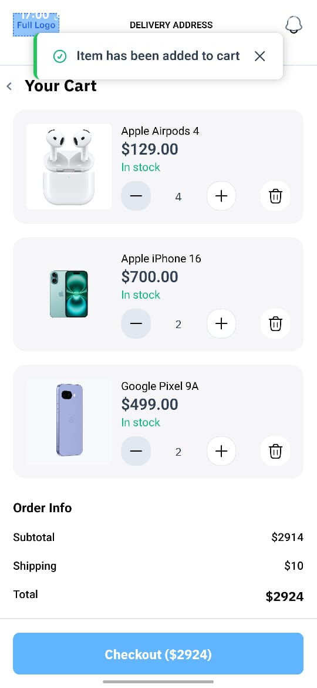

# 🛍️ React Native E-commerce App

A beautifully designed mobile e-commerce app built using React Native and TypeScript, featuring bottom tab navigation, product listings, detail views, cart functionality, and toast notifications.

>This is codebase for AlphaTwelve App Developer take-home assessment

---

## 🚀 Tech Stack

- **React Native**
- **TypeScript**
- **React Navigation** (Stack & Bottom Tabs)
- **Context API** (Cart state management)
- **react-native-toast-message** (Custom toasts)
- **Expo Assets / Metro bundler** for local image assets

---

## 📸 Screenshots

| Product List | Product Details | Cart |
|--------------|------------------|------|
|  |  |  |
|  |  |  |
react-native bundle --platform android --dev false --entry-file index.js --bundle-output android/app/src/main/assets/index.android.bundle --assets-dest android/app/build/intermediates/res/merged/release/ && cd android && ./gradlew :app:assembleRelease && ./gradlew assembleRelease && cd ..",
    

---

## ⚙️ Setup & Run

### 🧱 Prerequisites

- Node.js ≥ 18
- Yarn or npm
- React Native CLI
- Android Studio / Xcode for emulator or real device

---

### 🛠️ Installation

```bash
git clone https://github.com/mardillu/ecom-app.git
cd ecom-app
yarn install


---

### 📱 Run the App

#### iOS

```bash
npx react-native run-ios
```

#### Android

```bash
npx react-native run-android
```

> Emulator must be running or a device must be connected.

---

## 🧠 Features

* 🏠 Home screen with product grid
* 📦 Product details with image, description, price
* 🛒 Add to cart with custom toast feedback
* ✅ Cart badge on tab bar
* ❌ Remove single or all items from cart
* 📲 Clean tab navigation with custom icons

---

## 📁 Project Structure

```
src/
  ├── components/
  ├── context/
  ├── navigation/
  ├── screens/
  ├── styles/
  ├── assets/
```

---

## 📝 License

MIT License. Feel free to fork and adapt!

````
